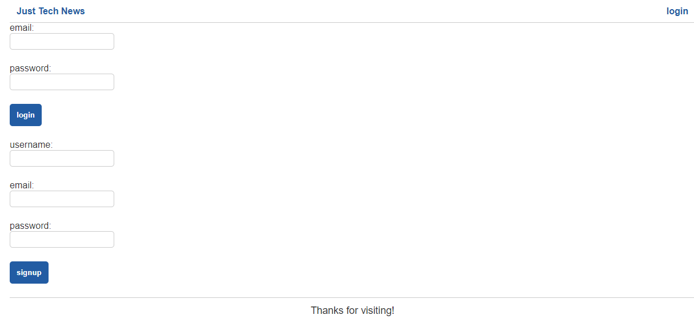

# Just Tech News

This Spring Boot Java application is a refactor of an existing full-stack JavaScript web application. Just like the original, this application allows users to make, comment upon, and vote on community-generated posts. This application uses a model-view-controller framework to handle data. Users are able to create and login to personal accounts, create, edit, and delete posts + upvote and comment on posts. The application on the front end uses ThymeLeaf for its templating engine. On the backend, Spring Boot replaces Node.js and Express.js, Spring Data JPA replaces Sequelize, and Spring Session replaces Express Session.

## Table of Contents

* [Installation](#installation)
* [Built Using](#built)
* [Usage Information](#usage)
* [Authors & Acknowledgements](#credits)
* [Contact](#questions)

## Installation 
This application has been deployed to Heroku and can be accessed via its link. For local use, please update application.properties with your respective MySQL credentials.

## Built Using 
* HTML
* CSS
* Java
* JavaScript
* Node.js
* MySQL
* Spring Data JPA
* ThymeLeaf
* Insomnia
* Heroku
* ClearDB MySQL
* IntelliJ IDEA

## Usage Information
[Just Tech News](https://cc-java-api-777.herokuapp.com/) 

This application hosts a forum for community-generated posts. 
  

## Authors & Acknowledgements

Base code © 2020 - 2022 Trilogy Education Services, a 2U, Inc. brand. All Rights Reserved.

Made by [TOVTC](https://github.com/TOVTC).

## Questions?
Contact repository author via [GitHub](https://github.com/TOVTC). 
    